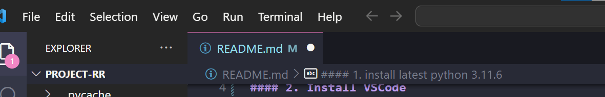

#### 1. install latest python 3.11.6
> https://www.microsoft.com/store/productid/9NRWMJP3717K?ocid=pdpshare

#### 2. Install VSCode
> https://code.visualstudio.com/download

#### 3.Unzip "Project-RR.zip".

#### 4.Drag Folder "Project-RR" to VSCode to open it in VsCode.

#### 5. Inside VSCode, Open Terminal from the Menu at the top

- Check if python is downloaded, use the following command:
```
python3 --version
```
or 
```
python --version
```
#### 6. Run this to install every package. All the packages are the latest. Copy the code in the code block then right click the terminal, it will be pasted.
```
pip install -r requirements.txt
```
#### 7. Run streamlit, use
```
streamlit run App.py
```
#### 8. Press Crtl + C in the terminal to exit.
#### Note: Very likely, cuz openAi is stupid, you need to click the "Generate Questions" button again to get the questions.
